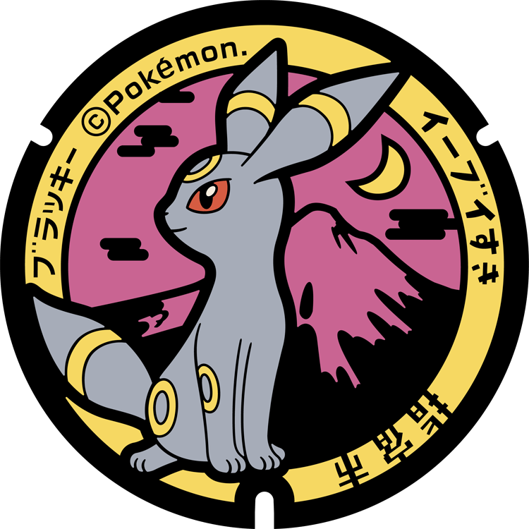

# IA Proyecto Final
Este repositorio alberga el proyecto final de la asignatura de IAV del curso 21-22.
## 1. Índice

1. [Índice](#1-índice)

2. [Propuesta](#2-propuesta)

3. [Introducción](#3-introducción)

4. [Punto de partida](#4-punto-de-partida)

5. [Restricciones](#5-datos)

6. [Planteamiento](#6-código)

7. [Video](#7-video)

8. [Errores conocidos](#8-errores-conocidos)

9. [Bibliografía](#9-bibliografía)
## 2. Propuesta

Para el proyecto final se hará una IA parecida a la de los combates que se aprecian en los juegos de Pokémon, para ello se usará un sistema parecido al que tiene pokemon, pero más básico, como por ejemplo: se ignoraran las habilidades de los pokémon como pueden ser: intimidación , presión, bromista,... sin embargo si se tendrá en cuenta la diferencia de tipos, los tipos de ataque, la diferencia entre ataque físico y ataque especial.

Para ello nuestra IA simulará ser un lider de Gimnasio por lo que tendrá de 2 a 4 pokemons, como mínimo uno sera tipo Siniestro puro y como mínimo otro contará con un doble tipo y las consecuencias de esto. 

La IA se enfrentará a un equipo rival que a su vez constará de un mínimo de 2 pokemons y un máximo de 6 teniendo entre ellos uno con al menos uno de sus tipos debíl al tipo siniestro y otro contando con un tipo fuerte frente al tipo siniestro.

En este combaté se supondrá que no existen objetos curativos tales como pociones, revivir, mas PP o parecidos.

Además en un principio no se tendrán en cuenta ataques que puedan alterar las stats ni el estado del pokemon, aunque esto puede variar.

Se intentará hacer una base de datos relacional (SQL) que contendrá los datos de los pokemons, los movimientos, etc...

## 3. Introducción

Pokémon es una franquicia que comenzó con la salida de dos juegos en 1996 *Pokémon Verde y Pokémon Rojo* tras su éxito se expandió a la creación de un anime, juegos de cartas, ropa, ...
Tanta ha sido la fama que ha conseguido Pokémon que incluso a día de hoy se usa para promover el turismo como es nombrar a ciertos pokémons embajadores de una perfectura, o cambiar las tapas de alcantarilla por unas decoradas con pokémons.

Lapras nombrado embajador de Miyagi   |  Tapas de alcantarilla
:-------------------------:|:-------------------------:
  |  
[Información acerca de pokemon embajadores](https://local.pokemon.jp)| [Información acerca de tapas de alcantarillas](https://alfabetajuega.com/pokemon/alcantarillas-pokefuta)

Si deseas saber como empezó toda la franquicia de Pokémon te recomiendo que veas la [1º parte del monográfico de Pokémon de BaityBait](https://www.youtube.com/watch?v=1K_wJlkZ-YA), aunque lo hace de una forma sátirica y quizás poco profesional, explica muy bien como empezó toda esta franquicia y como se empezó a desarrollar.

La mecánica de los combates pokémon casi no ha variado desde sus inicios, en ellos se enfrentarán dos entrenadores(en ocasiones 4 entrenadores en combates de 2 vs 2) pokémon que contarán como mucho con 6 pokémons y que normalmente se enfrentan 1vs1 aunque hay variaciones en las que pueden luchar 2vs2 o incluso 3vs3 con una mecánica de rotación sin embargo en este proyecto nos centraremos en los combates 1vs1.

## 4. Punto de partida

El punto de partida será un proyecto vacio. Hablando con el profesor se habló de un proyecto realizado por algunos alumnos el año pasado, aunque se trata de un proyecto distinto ya que ellos eran 3 y además no poseia una base de datos. Sin embargo tras hablar con algunos de los miembros de dicho proyecto se me recomendó que mirase una serie de videos.

## 5. Datos

Para almacenar los datos se pensó usar una base de datos relacional (SQL) con el siguiente esquema:


Para ello se usuarían los archivos que se pueden encontrar en [DBFiles](DBFiles/), se ejecutarían en el siguiente orden:

1. [CreateTables.sql](DBFiles/CreateTables.sql)
2. [Inserts.sql](DBFiles/Inserts.sql)

Sin embargo debido a la falta de conocimientos y la dificultad que suponia conectar la base de datos con el proyecto Unity se descartó (hablando previamente con el profesor) y se pasó a hacer una carga de datos mediante archivos JSON, para ellos se tendrán varios archivos. Mediante el código de C# los datos en los JSONs se relacionarán entre ellos, simulando una base de datos relacional. Para ello se hará uso de la clase [Dictionary](https://docs.microsoft.com/es-es/dotnet/api/system.collections.generic.dictionary-2?view=net-6.0). Por desgracia al usar JSON no se puede poner como condición que la clave de un dato debe encontrarse en otra entidad,como si se podría en SQL, usando lo siguiente:
```SQL
--...
id VARCHAR(N) NOT NULL REFERENCES entidad(atributo),
--...
```
Por lo que debe ser el encargado de crear los JSON el que debe asegurarse de que las claves son correctas.
Para ello aquellos datos que no sean editables serán guardados en [Struct](https://docs.microsoft.com/es-es/dotnet/csharp/language-reference/builtin-types/struct), mientras que los datos que si sean editables se guardarán en [clases](https://docs.microsoft.com/en-us/dotnet/csharp/fundamentals/types/classes).


## 6. Código
### Control de Datos
En cuanto al código ya que la idea es simular que se esta conectando a una base de datos relacional los pokemons como tal van a ser Structs ya que se van a considerar como si fueran peticiones constantes a la base de datos.
```py
#Peticion en codigo a la base relacional creada para obtener el pokemon
valor : DataBase().GetPokemons()["Clave"]
```
```SQL
--Misma petición en SQL
SELECT *
FROM pokemon
WHERE pokemon.id="Clave";
```
### Flujo de turno
En el siguiente diagrama se enseñará como se procesa cada uno de los turnos.


Para ello se usá el siguiente código:
```py
function ProcessTurn()
    if(playerDecision.change)
        if(IADecision.change)
            player.ChangePokemon()
            IA.ChangePokemon()
        else
            IA.Attack()
            if(player.CurrentPokemon().IsDead())
                player.ProcessDie()
    else
        if(IADecision.change)
            IA.ChangePokemon()
            player.Attack()
            if(IA.CurrentPokemon().IsDead())
                IA.ProcessDie()
        else 
            if(IA.CurrentPokemon().speed>=player.CurrentPokemon().speed)
                IA.Attack()
                if(player.CurrentPokemon().IsDead())
                    player.ProcessDie()
                else
                    player.Attack()
            else
                player.Attack()
                if(IA.CurrentPokemon().IsDead())
                    IA.ProcessDie()
                else
                    IA.Attack()
```

### IA

Nuestra IA representa a un lider de tipo siniestro y por ello solo usa pokémons que contienen ese tipo pero realmente es adaptable a cualquier pokemon.

Esta IA siempre sacará el pokémon menos débil frente al pokemon actual del rival, si el rival cambia de pokémon, la IA procesará si debe cambiar de pokémon o seguir con el actual.

```py
function BestPokemon(Pokemon rival)
    rels=Database().GetRelations()
    currentBestPokemonID : currentPokemonID
    bestDebility : 99
    currentDebility : bestDebility
    for(Pokemon p in Team)
        if(p.IsAlive())#Solo comprueba pokemons vivos
            currentDebility=rels[rival.type1][currentPokemon.type1]
                if(currentPokemon.HasTwoTypes())
                    currentDebility=currentDebility*rels[rival.type1][currentPokemon.type2]
            if(rival.HasTwoTypes())
                currentDebility=currentDebility*rels[rival.type1][currentPokemon.type2]
                if(currentPokemon.HasTwoTypes())
                    currentDebility=currentDebility*rels[rival.type1][currentPokemon.type2]
            if(currentDebility<bestDebility||(currentDebility==bestDebility&&currentPokemonID==currentBestPokemonID))#Si la debilidad es la mejor o es equivalente a la mejor y se trata del pokemon en el campo entonces es la mejor opcion
                currentBestPokemonID=p.id
                bestDebility=currentDebility

    return currentBestPokemonID
```

Si ya se encuentra con el mejor pokemon posible entonces atacará con el mejor ataque, basandose en el pokemon que se encuentra al comienzo del turno frente a él, entonces realizará el mejor de los ataques con los que dispone teniendo en cuenta como afecta la ventaja de tipos y tambiém se fijara en funcion del daño que aplicaría teniendo en cuenta si el ataque es físico o especial y las stats del pokémon.

Sin embargo para no hacer todas las batallas iguales se dejará una probabilidad del 18`75% de que realize un movimiento que no sea el mejor.


```py
funtion BestMovement(Pokemon rival)
        maxDamage : 0
        bestAttack : 0
        db : DataBase()
        currDamage : 0
        for (Move m in moves)
            if (m.currpp > 0)
                currDamage = CalculateDamage(rival, m)
                if (maxDamage < currDamage)
                    bestAttack = i
                    maxDamage = currDamage   
        #Hay un 18.75% de que no use el mejor ataque
        if (Random.Range(0, 101) > 25)
            return moves[bestAttack]
        else
            return moves[Random.Range(0, db.GetMovements().GetMoves()[idActualPokemon].Count)]
```

### 7. Video

[](AssetsREADME/ProyectoIA.mp4)

### 8. Errores conocidos

* No hay feedback visual para saber que ataque ha realizado la IA

* Para evitar posibles problemas las palabras con "ñ" han sido sustituidas por "ni" ejemplo arañazo ==> araniazo

### 9. Bibliografía

* [Repositorio del año pasado](https://github.com/El-AMPA/PAM_ProyectoIA)

* [Enalce al canal que contiene los videos](https://www.youtube.com/c/GameDevExperiments/videos)